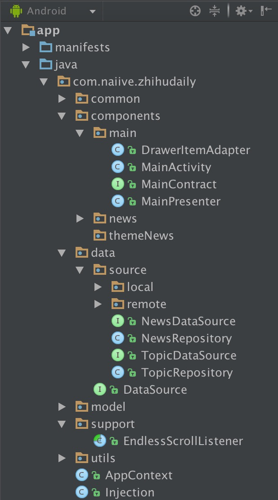

#ZhihuDaily RxJava MVP
知乎日报的非官方版本，项目采用 Google MVP + Retrofit + RxJava 。

应用的API来源为 [izzyleung/ZhihuDailyPurify](https://github.com/izzyleung/ZhihuDailyPurify/wiki/知乎日报-API-分析)，在这里表示感谢。

##Architecture
###Packaging


###Code
根据功能模块分为不同的包，在每个功能模块中定义Contract，配置View以及Presenter的方法。

```java
public interface MainContract {

    interface View extends BaseView<Presenter>{

        void showDrawerItems(List<DrawerItem> list);

        void showEmpty();

        void hide();

    }

    interface Presenter extends BasePresenter{

        void getDrawerList();

        void updateDrawerList();
    }
}
```
``MainPresenter``中的RxJava的运用，这里暂时还没有对``subscriber``进行封装。

这里从``mRepository``通过一定的策略返回内存缓存、磁盘缓存或者网络数据源的Observable。


```java
private void loadDrawerList(boolean forceUpdate) {
        if (forceUpdate)
            mRepository.refreshThemes();

        Subscription subscription = mRepository.convertDrawerItems()
                .compose(Relper.<List<DrawerItem>>applySchedulersIoMain())
                .subscribe(new Action1<List<DrawerItem>>() {
                    @Override
                    public void call(List<DrawerItem> drawerItems) {
                        mView.showDrawerItems(drawerItems);
                        mView.hide();
                    }
                }, new Action1<Throwable>() {
                    @Override
                    public void call(Throwable throwable) {
                        mView.showEmpty();
                    }
                });

        addSubscription(subscription);
    }
```
通过代理类来将Repository作为单例进行管理，目的是保存数据状态。

```java
public static TopicRepository provideTopicRepository(){
        return DataSource.Proxy.create().get(TopicRepository.class);
    }
```


###Libraries
- RxJava 
- RxAndroid
- Retrofit2
- OkHttp3
- Glide
- DiskLruCache
- BaseRecyclerViewAdapterHelper
- Banner

##TODO LIST

- [x] 内容详情页
- [ ] 左右滑动切换内容页
- [ ] 登录模块


#License


    Copyright 2016 Mythss
 
    Licensed under the Apache License, Version 2.0 (the "License");
    you may not use this file except in compliance with the License.
    You may obtain a copy of the License at

       http://www.apache.org/licenses/LICENSE-2.0

    Unless required by applicable law or agreed to in writing, software
    distributed under the License is distributed on an "AS IS" BASIS,
    WITHOUT WARRANTIES OR CONDITIONS OF ANY KIND, either express or implied.
    See the License for the specific language governing permissions and
    limitations under the License.


